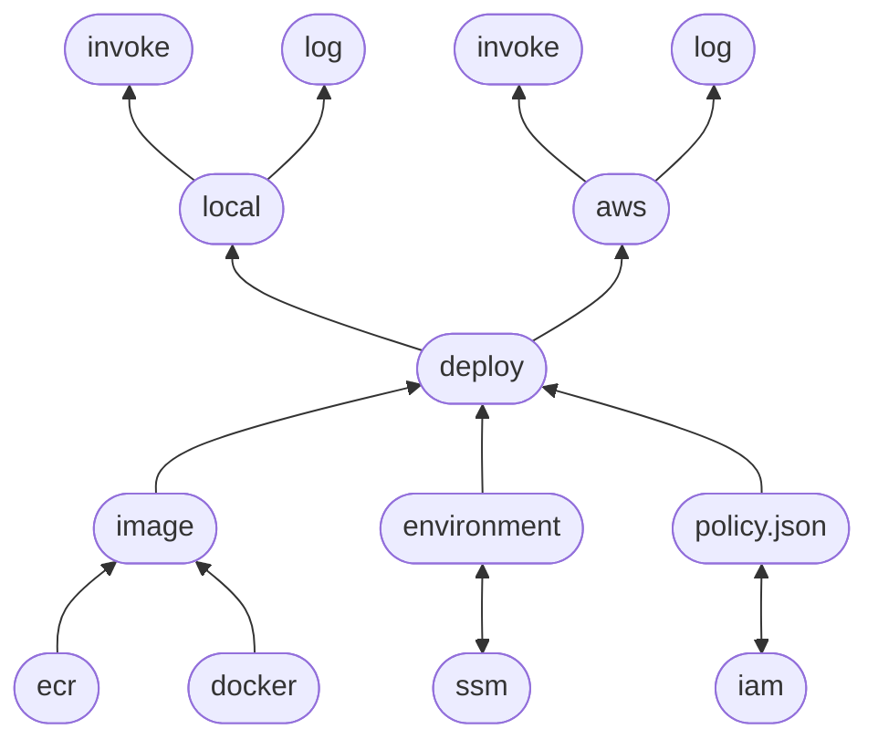

# Sentential
Sentential provides developers the means to confidently build, verify, and deploy their code to AWS Lambda.

## Other Tools
There are many other great tools in this space. To name a few:

- [AWS Sam](https://aws.amazon.com/serverless/sam/)
- [Serverless](https://www.serverless.com/)
- [Terraform](https://www.terraform.io/)
- [Pulumi](https://www.pulumi.com/)

These are excellent tools.

## Why Another Tool?
In developing lambdas I found myself wanting one simple thing to be known:

> Will my code have _everything_ it needs to run?

Sentential aims to make this question knowable before deployment, and enjoyable to manage deployment itself.

## Scope
Sentential doesn't want to manage your IaC.

It's best to think of Sentential as an artifact manager. The artifact is your code, in a callable location, with everything it needs to do what it is intended to do.

Your IaC can configure what calls your artifact.

The cloud is the execution harness, into which you mount your artifact.

