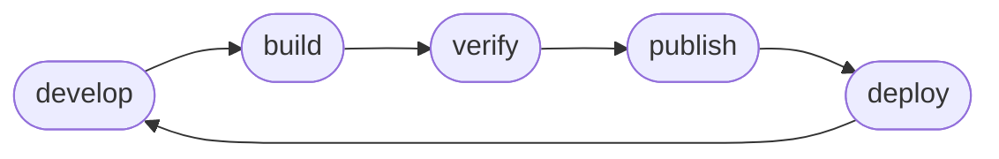

# Flow

You will find this workflow repeated throughout the documentation.



### Develop

See `sntl init --help`

```bash
> sntl init <ecr_repo_name> <language>
.
├── Dockerfile
├── policy.json
├── shapes.py
└── src

1 directory, 3 files
```

Develop your application within the `src` directory.

### Build

See `sntl build --help`

Sentential uses container images as the deliverable artifact for Lambda functions. So the `Dockerfile` created is *the* build definition for the project.

```dockerfile
FROM ghcr.io/linecard/entry:latest AS entry
FROM public.ecr.aws/lambda/<language>:latest AS runtime
ENV AWS_LAMBDA_EXEC_WRAPPER=/bin/wrapper.sh
COPY --chmod=755 --from=entry / /bin/

FROM runtime AS <ecr_repo_name>
COPY src/ ${LAMBDA_TASK_ROOT}

# insert application specific build steps here

CMD ["app.handler"]
```

You will will notice this is a [multistage build](https://docs.docker.com/build/building/multi-stage/).
- `...AS entry` delivers a lambda [runtime exec wrapper](https://docs.aws.amazon.com/lambda/latest/dg/runtimes-modify.html) called [entry](https://github.com/linecard/entry).
- `...AS runtime` will be an AWS maintained base image for the language you chose during `init`.
- `...AS <ecr_repo_name>` is the step in which you build your application.

Also worthy of note is the `CMD` stanza. As can be derived from the [official documents](https://docs.aws.amazon.com/lambda/latest/dg/images-create.html), your lambda container image will use the dot notated path to find the file, and function name, of the handler. By default, `app.handler` implies a file such as `src/app.py` in which a function of name `handler` resides.

### Verify

See `sntl deploy local --help`

Once you have built your artifact you can deploy your lambda locally and invoke it to verify it...

```bash
> sntl deploy local
> sntl invoke local '{ "json": "payload" }'
# verify expected output
```

### Publish

See `sntl publish --help`

If your artifact is verified and ready for deployment to AWS...

```bash
> sntl login # ensure you are logged into ECR
> sntl publish
> sntl ls

  build   arch    status    hrefs  
 ───────────────────────────────── 
  local   amd64   running   []     
  0.0.1   amd64             []     
```

You will see a semantically versioned image, in this case `0.0.1`, now available for deployment.

### Deploy

See `sntl deploy aws --help`

```bash
> sntl deploy
> sntl invoke aws '{ "json": "payload" }'
# verify expected output
```
