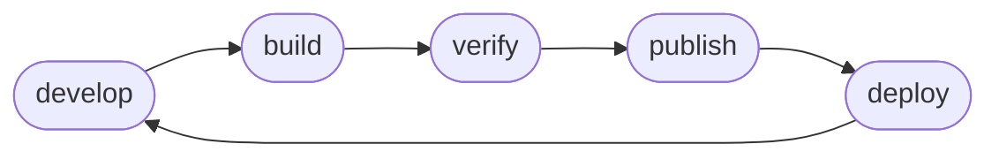

# Flow

This section aims to highlight the flow of developing with Sentential at a high level. The pattern Sentential operates on can be visualized like so...

## Develop

Sentential assumes your source code to be in the `./src` dir in the root of your project. This is a convention, and is changed in no special fashion.

## Build

Sentential builds `./src` into your ECR image. What your build consists of is up to you, defined in the `Dockerfile`.

## Verify

Sentential allows you to locally deploy a lambda for verification, this includes IAM permissions parity and Environment Variable parity.

## Publish

Sentential is opinionated on semver and publishes builds to ECR.

## Deploy

Sentential deploys to AWS in a simple manner, due to what you have defined and verified above.

