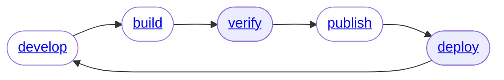

# Deploy



Sentential aims for parity between deploying to the local environment and the cloud environment.

Parity between local and AWS is achieved across:
- Permissions.
- Execution Environment.
    * Software Dependencies.
    * Environment Variables.
    * Secrets.
- Interface.

### Local (Verify)

Around the docs we see `verify` used. To Sentential verification is synonymous with locally deploying a Lambda. 

```shell
> sntl deploy local
```

### AWS

```shell
> sntl deploy aws
```

## Moving Parts

### Permissions

When deploying locally, Sentential attempts to generate temporary credentials for your Lambda scoped to the `policy.json`. In doing so, your local Lambda far closer replicates behavior expected in AWS.

Whether or not your user is able to generate such temporary tokens is requisite on your permissions as an IAM entity.

Sentential fails down this stack when trying to properly emulate Lambda credentialing...
1. Assume current identity with a policy constraint.
2. Generate federated token with a policy contraint.
3. Use current user credentials, printing a warning that emulation is incomplete.

### Execution Environment

Since the Lambda is created with a `Dockerfile` it's trivial to ensure whatever OS level or software level dependencies you might need are preset. If the Lambda fails on a dependency locally, you are assured it will fail in AWS. And vice versa.

All configuration for sentential is stored in SSM. When executing a Lambda, [entry](https://github.com/linecard/entry) is used to export your projects `envs` and `secrets` to the Lambda environment before all other processes. Both Local and AWS deployments evaluate the same SSM parameters at invoke time. This means that if your local Lambda deployment has what it needs, your AWS deployment will too.

### Interface

All locally running lambdas utilize the [Lambda Runtime Interface Emulator](https://github.com/aws/aws-lambda-runtime-interface-emulator).

The outcome of this is most easily apperceive via example:

```bash
# Invoke Lambda in AWS
aws lambda invoke \
 --function-name my-function \
 --cli-binary-format raw-in-base64-out \
 --payload '{"hello": "world"}' \
 response.json

# Invoke Lambda locally
aws lambda invoke \
 --endpoint http://localhost:9000 \ # <- note the only difference.
 --function-name my-function \
 --cli-binary-format raw-in-base64-out \
 --payload '{"hello": "world"}' \
 response.json
```

### Further reading
- [Further reading](https://docs.aws.amazon.com/lambda/latest/dg/images-test.html)
- [Custom Images](/#/custom_images/description)