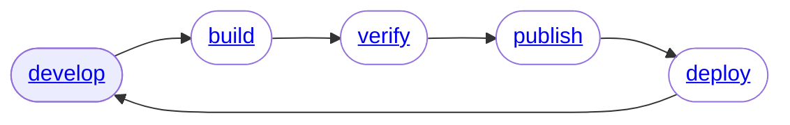

# Develop



The `init` command can be used to create a new project. It scaffolds a small number of files/folders as described below.

```bash
> sntl init <ecr-repo-name> <desired-language>
> tree
.
├── Dockerfile
├── policy.json
├── shapes.py
└── src
```

## Moving Parts

### ./src

The source directory is the assumed location of your source code. This can be modified in the `Dockerfile` if desired.

### Dockerfile

The `Dockerfile` generated has a comment implying where you should configure your build steps. If you are familiar with `Dockerfile`s, you will find it straight forward to go beyond the base convention.

### policy.json

The `policy.json` file is a templated IAM policy, reprisenting the permissions of your Lambda under development.

### shapes.py

The `shapes.py` file is an optional way to define a schema for your Environment Variables, Secrets, Tags, and Build Args.

Said another way, it allows you to strictly define and describe the requiremented parameters for your Lambda to work.

