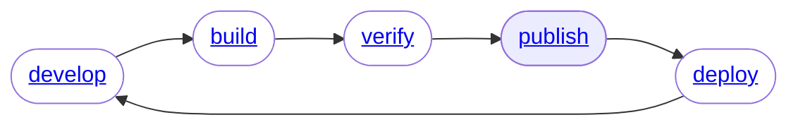

# Publish



Sentential is opinionated about how to manage publishing and versions. This is for two reasons:
1. SemVer is a highly defensible convention for broad use.
2. By conventionalizing we can trivialize the process of publishing.

```shell
> sntl publish          # bumps build number
> sntl publish --minor  # bumps minor number, zeros build number
> sntl publish --major  # bumps major number, zeros minor and build numbers.
```

## Moving Parts

### Login

Before you can publish, you may have to login to ECR. This is left as an idividual step largely on purpose.

```shell
> sntl login
```

### ECR Repo

The repo your project will try to publish to is found in the Dockerfile here...

```Dockerfile
FROM runtime AS <repository_name>
```

The convention is bland: your Lambda is always the result of the stage built from `runtime` and named as `<repository_name>`. It also uses this convention to decide on where to publish in ECR.